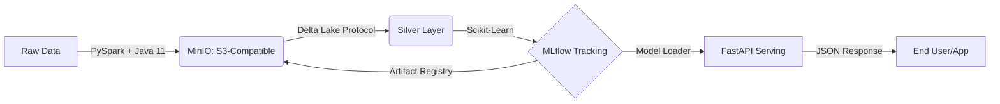

# OpenLake MLOps Platform 🚀

Uma prova de conceito (PoC) de uma plataforma de **Engenharia de Machine Learning (MLOps)** ponta a ponta. Este projeto demonstra a transição de scripts de dados isolados para uma arquitetura escalável baseada em **Lakehouse (Delta Lake)** e orquestração de containers.

O objetivo é cobrir todo o ciclo de vida dos dados: desde a ingestão distribuída (Big Data) até o deployment de modelos preditivos em produção via API REST.

---

## 🏗️ Arquitetura da Solução

O sistema segue uma abordagem modular (*Polyglot*), separando armazenamento, processamento, rastreamento e inferência em microsserviços.



### 🧰 Tech Stack
| Componente | Tecnologia | Função no Projeto |
| :--- | :--- | :--- |
| **Infraestrutura** | Docker Compose | Orquestração local de containers (compatível com Coolify). |
| **Object Storage** | MinIO | Simulação de AWS S3 para a fundação do Data Lake. |
| **Processamento (ETL)** | Apache Spark (PySpark) | Processamento distribuído e transformação de dados. |
| **Storage Layer** | Delta Lake | Camada transacional ACID (Time Travel e confiabilidade). |
| **Tracking (MLOps)** | MLflow + PostgreSQL | Registro de experimentos, hiperparâmetros e Model Registry. |
| **Serving (API)** | FastAPI & Uvicorn | API assíncrona de alta performance para inferência em tempo real. |

---

## 📁 Estrutura do Projeto

O repositório está dividido logicamente por domínio de atuação:

* `etl/`: Pipeline de Engenharia de Dados (Ingestão e transformação com Spark).
* `ml/`: Ciência de Dados e Tracking (Treinamento do modelo e logs no MLflow).
* `serving/`: Engenharia de Software (API REST encapsulando o modelo para produção).
* `docker-compose.yml`: Infraestrutura de base (MinIO, Postgres, MLflow Server).

---

## 🚀 Como Executar Localmente

### 1. Pré-requisitos
* **Docker** instalado e rodando.
* **Python 3.12+** e um ambiente virtual (`.venv`) configurado.
* **Java 11** instalado (obrigatório para o Apache Spark se comunicar com o Hadoop-AWS).

### 2. Configuração do Ambiente
Crie um arquivo `.env` na raiz do projeto usando o exemplo fornecido:
```bash
cp .env.example .env
```
Instale as dependências:
```bash
pip install -r requirements.txt
```

### 3. Subindo a Infraestrutura Base
Inicie o MinIO (Storage) e o MLflow (Tracking Server):
```bash
docker compose up -d
```
* Acesse o MinIO em `http://localhost:9001` e crie um bucket chamado `lakehouse`.
* O painel do MLflow estará disponível em `http://localhost:5000`.

### 4. Pipeline de Engenharia de Dados (ETL)
Execute o job PySpark para ingerir os dados e salvá-los no formato Delta no MinIO:
```bash
JAVA_HOME=/usr/lib/jvm/java-11-openjdk-amd64 python etl/src/ingest.py
```

### 5. Treinamento do Modelo (MLOps)
Treine o modelo Random Forest. O MLflow fará o log automático das métricas e salvará o artefato (`.pkl`) no MinIO:
```bash
python ml/src/train.py
```
*(Anote o `Run ID` gerado no painel do MLflow para o próximo passo).*

### 6. Serving (Inferência em Produção)
Configure o `RUN_ID` no arquivo `serving/src/main.py` e inicie a API:
```bash
uvicorn serving.src.main:app --reload
```
Faça um teste de previsão:
```bash
curl -X 'POST' \
  'http://localhost:8000/predict' \
  -H 'Content-Type: application/json' \
  -d '{
  "age": 28,
  "score": 85
}'
```

---

## 👨‍💻 Desenvolvedora
**Maria Letícia** - Estudante de Engenharia de Computação.
Projeto desenvolvido como portfólio de Engenharia de Plataforma e Sistemas Distribuídos.
