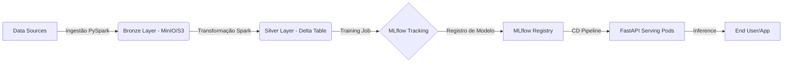

# OpenLake MLOps Platform


## 📋 Sobre o Projeto

O **OpenLake MLOps** é uma prova de conceito (PoC) de uma plataforma de Engenharia de Machine Learning robusta, projetada para cobrir todo o ciclo de vida dos dados: da ingestão distribuída ao deployment de modelos em produção.

O objetivo principal é demonstrar como transicionar workloads de dados tradicionais para uma arquitetura moderna baseada em **Containers (Kubernetes)** e **Lakehouse (Delta Lake)**, garantindo escalabilidade, governança e reprodutibilidade.

Este projeto foi desenhado para resolver problemas comuns de ML em produção:
* Processamento de grandes volumes de dados (Big Data) que não cabem na memória RAM.
* Versionamento de dados e "Time Travel" (Delta Lake).
* Rastreabilidade de experimentos e modelos (MLflow).
* Escalabilidade de inferência (K8s HPA).

---

## Arquitetura da Solução

O sistema segue uma abordagem modular, onde cada componente roda isolado em containers dentro do cluster Kubernetes.


🛠️ Tech StackComponenteTecnologiaFunção no ProjetoOrquestraçãoKubernetes (K3s/MicroK8s)Gerenciamento de containers e recursos.Object StorageMinIOSimulação de S3 (AWS) para Data Lake.ProcessamentoApache Spark (PySpark)Processamento distribuído de dados massivos.Storage LayerDelta LakeCamada transacional ACID sobre o Data Lake.ML OpsMLflowTracking de métricas, parâmetros e Model Registry.ServingFastAPI & UvicornAPI de alta performance para inferência em tempo real.CI/CDGitHub ActionsAutomação de testes e build de imagens Docker.

Como Executar Localmente
Pré-requisitos
Docker & Kubernetes (recomendo K3s ou Docker Desktop com K8s ativo).

Python 3.9+

Helm (para gerenciar pacotes no K8s).

. Infraestrutura (Setup do Cluster)
Suba os serviços base (MinIO e MLflow) através dos manifestos:

```Bash

# Criar namespace dedicado
kubectl create namespace openlake

# Deploy do MinIO (Data Lake)
kubectl apply -f infra/k8s/minio-deploy.yaml -n openlake

# Deploy do MLflow (Tracking Server)
kubectl apply -f infra/k8s/mlflow-deploy.yaml -n openlake

```
2. Pipeline de Engenharia de Dados (ETL)
Execute o job Spark para ingerir os dados brutos e convertê-los para tabelas Delta:

```Bash

# Submissão do job Spark dentro do cluster
kubectl apply -f etl/spark-job-ingest.yaml
Este job lê o dataset de data/raw, aplica limpeza e salva em s3a://lakehouse/silver em formato Delta.
```
3. Treinamento de Modelo
Dispare o pipeline de treinamento. O script conectará automaticamente ao MLflow para registrar o experimento:

``` Bash

kubectl apply -f ml/training-job.yaml
Você pode acessar a UI do MLflow em http://localhost:5000 para ver as métricas (Acurácia, F1-Score) e o artefato do modelo salvo.
```
4. Serving (Inferência)
Suba a API que carrega o modelo "Production" do MLflow:

```Bash

kubectl apply -f serving/api-deployment.yaml
```
Teste a API:

```Bash

curl -X POST "http://localhost:8000/predict" \
     -H "Content-Type: application/json" \
     -d '{"feature1": 0.5, "feature2": 1.2, ...}'

```
## Decisões de Engenharia
Por que Spark no Kubernetes?
Diferente de clusters Hadoop tradicionais (YARN), rodar Spark no K8s permite isolamento total de recursos e elasticidade. Se o job de ETL precisar de mais memória, o K8s aloca novos pods dinamicamente, liberando recursos quando o job termina.

A Escolha do Delta Lake
Para garantir a confiabilidade dos dados ("Data Reliability"), o formato Parquet simples não é suficiente. O Delta Lake traz logs de transação (ACID), permitindo que leituras e escritas ocorram simultaneamente sem corromper o Data Lake, essencial para pipelines de retreino contínuo.

## Contato
Projeto desenvolvido como portfólio de Engenharia de Plataforma.
